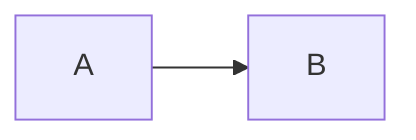

# docs/diagrams — Mermaid 原始碼

這個目錄放工作坊所有圖的 **Mermaid 原始碼**（`.mmd`）。它們是 `docs/references/` 與 `docs/days/` 裡圖的單一來源；學員 Day 3 的 `context-map.md` / `c4.md` 可以從這裡複製再改成自己的版本。

## 檔案

| 檔案 | 圖型 | 對應教材 | 一句話 |
|---|---|---|---|
| `context-map.mmd` | flowchart | `references/ddd-strategic.md` §5 | 五個 Bounded Context 與七種關係模式（ACL、Partnership、Customer–Supplier、Conformist、Published Language、Separate Ways） |
| `c4-context.mmd` | C4Context | `references/c4.md` §4.1 | System Context：五位角色、我們的系統、三個外部系統 |
| `c4-container.mmd` | C4Container | `references/c4.md` §4.2 | Container：場站節點 vs 總部節點、OCPP 端點、API、DB、Outbox relay、bus |
| `event-flow.mmd` | sequenceDiagram | `domain/ev-charging-primer.md` §7、`references/eda.md` | 14:02 → 18:18 那個午後：正常充電 + 故障開單派工；`scripts/e2e` 的原型 |
| `hexagonal.mmd` | flowchart | `references/hexagonal.md` §3 | starter 目錄的 ports & adapters；依賴規則 |
| `fault-saga.mmd` | stateDiagram-v2 | `references/eda.md` §7 | WorkOrder 狀態機：申告 → 開單 → 派工 → 修復驗證 → 恢復可售；R5 去重 |

所有識別碼來自 `docs/curriculum.md` §1.6（`SITE-TPE-01`、`CP-A12`、`CP-A12-2`、`ABC-1234`、`P-441`、`S-991`、`TAG-MONTHLY-77`、`INV-778`、`WO-2208`、`TECH-HAO`），事件名來自 §1.7–§1.9。**改圖前先改 curriculum。**

## 怎麼渲染

### 1. GitHub（零安裝）
GitHub 會直接渲染 Markdown 裡的 ```` ```mermaid ```` 區塊。把 `.mmd` 的內容貼進 md 檔的 mermaid 區塊即可：

````markdown

````

`.mmd` 檔本身 GitHub 不會渲染（會顯示原始碼），所以教材裡都是複製進 md。

### 2. VS Code
裝擴充套件 **Markdown Preview Mermaid Support**（bierner.markdown-mermaid），開 md 檔按 `Ctrl+Shift+V` 預覽。要直接預覽 `.mmd` 檔，另裝 **Mermaid Preview**（vstirbu.vscode-mermaid-preview）。

### 3. mermaid.live（瀏覽器）
打開 https://mermaid.live ，把 `.mmd` 內容貼到左邊，右邊即時渲染；可匯出 PNG / SVG。投影時用這個。

### 4. 命令列（可選，產 PNG / SVG 進簡報）
```bash
npm install -g @mermaid-js/mermaid-cli
mmdc -i docs/diagrams/event-flow.mmd -o /tmp/event-flow.svg
```

## 語法注意

- **C4 圖**（`C4Context` / `C4Container`）需要 Mermaid ≥ 9.3；GitHub 與 mermaid.live 都支援。`Rel` 的第四個參數是協定 / 技術，會顯示在線上。`UpdateLayoutConfig` 控制每列幾個框。
- **sequenceDiagram** 裡 `-->>` 是虛線（我們用來表示事件），`->>` 是實線（命令 / 呼叫）。`rect rgb(...)` 是背景區塊。
- **stateDiagram-v2** 的狀態描述用 `state "多行<br/>描述" as Alias`。
- **flowchart** 的 `classDef` 定義顏色；`-.->` 虛線、`x-.-x` 兩端叉叉（Separate Ways）。
- 中文與 `<br/>` 在所有渲染器都正常；但 **不要在標籤裡用未跳脫的雙引號**。

## 修改規則

1. 事件名、識別碼、context 名一律對齊 `docs/curriculum.md`；發現不一致以 curriculum 為準。
2. 一張圖一個層級、一個問題。想加東西時先問「這屬於哪一張圖」。
3. 加新圖時更新本 README 的表格與對應教材。
4. 學員不要改這裡的檔案；複製到 `workshop/day3/` 再改。
