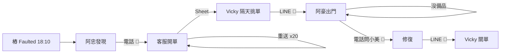

# BPR 與價值流思考（Business Process Reengineering）

> Day 1 B3 的方法論。交付物：`workshop/day1/as-is.md`、`workshop/day1/to-be.md`。用 `/bpr-review` 檢查。

## 讀完你會拿到

- 知道 BPR 為什麼在一個「軟體設計工作坊」的第一天出現。
- 一套畫 As-Is 顧客旅程的方法，以及「人當 API」（Human-as-API）的辨識法。
- 本工作坊採用的 BPR 四原則，每條都對到 curriculum 的一個耦合陷阱。
- 用 14:02 → 18:18 的午後做的完整 As-Is / To-Be 範例。

---

## 1. 為什麼第一天要學 BPR

Hammer 1990 年那篇文章的標題是全部重點：**Don't Automate, Obliterate**（別自動化，要剷除）。

1–3 年的工程師拿到需求時最自然的反應是「把現在的流程做成系統」。結果是：阿忠打電話給客服開工單的流程，被做成「阿忠在網頁上填表送出，客服在另一個網頁上按核准」。電話換成了表單，**流程一樣爛**。

BPR 問的是另一個問題：**如果今天重新設計這件事，這個步驟還需要存在嗎？**

在我們的領域裡，答案通常是：不需要。樁自己會說它壞了（`ChargerFaulted`），為什麼要人打電話？

DDD 的 Bounded Context、Event Storming 的時間線、EDA 的事件流，全部都建立在「你知道業務**應該**怎麼流」之上。不先做 BPR，你只是把爛流程用更漂亮的架構重寫一遍。

---

## 2. 核心觀念

### 2.1 流程（process）vs 功能（function）

- 功能：部門做的事。「客服部負責開工單」。
- 流程：從觸發到顧客拿到結果的完整路徑。「從樁壞掉到樁恢復可售」。

BPR 只看流程。功能是流程被組織切碎後的殘骸。

### 2.2 價值流（value stream）

Lean 的概念，BPR 借來用：把一條流程從頭到尾攤開，標每一步：

- **增值時間**：真的在改變結果的時間（技術員換模組：30 分鐘）。
- **等待時間**：在排隊、在等人、在傳話（電話 → 客服 → 工單 → LINE → 技術員：平均 20 分鐘 + 一個晚上）。

典型流程增值時間占不到 10%。**BPR 的目標是砍等待，不是加速增值**。

### 2.3 「人當 API」（Human-as-API）

工作坊的核心啟發式（heuristic）。在 As-Is 流程裡找這種步驟：

> 某個人做的事，本質上是「把 A 系統的資料讀出來，用電話 / email / Excel / 貼紙，放進 B 系統或另一個人的腦袋」。

這個人**就是一支 API**——只是延遲很高、會下班、會漏。

辨識方法：問「如果這個人今天請假，什麼會停？」如果答案是「資料傳不過去」，圈起來。

curriculum §1.7 每一列的「不該發生的耦合」其實都是兩種病之一：**人當 API**（該自動的沒自動）或**系統過度耦合**（不該同步的同步了）。BPR 抓前者，DDD 抓後者。

### 2.4 As-Is 與 To-Be

- **As-Is**：現在怎麼做。畫的時候**不准改**，包括所有蠢步驟。誠實比整齊重要。
- **To-Be**：套用原則之後應該怎麼做。每一處改動要能指出「用了哪條原則」。

中間的差距就是你的 backlog。

---

## 3. 本工作坊採用的 BPR 四原則

Hammer 原文列了七條，我們挑四條，每條都對到一個 curriculum §1.7 的耦合。

| # | 原則 | 一句話 | 在我們領域裡 |
|---|---|---|---|
| P1 | **圍繞結果組織，而非任務**（Organize around outcomes, not tasks） | 一條流程的擁有者是「結果」，不是「部門」 | 「故障 → 恢復可售」是一個結果，AssetOps 擁有它；不是客服開單 + 調度派工 + 技術員修 + 客服關單四個部門各管一段 |
| P2 | **資訊在源頭一次捕獲**（Capture information once, at the source） | 資料在它誕生的地方就變成數位事實，不再由人抄寫 | 樁說 `Faulted` 的那一刻就是 `ChargerFaulted`；阿忠不該是資料的搬運工。阿忠的手動放行在按下按鈕的那一刻就是 `ParkingManuallyReleased`，不是隔天的 email |
| P3 | **決策點放在工作發生處**（Put the decision point where the work is performed） | 現場能決定的事不要送到總部決定 | 放行由場站決定（R6）；授權由場站本機白名單決定；總部只訂閱結果 |
| P4 | **以事件連接平行活動，而非事後整合結果**（Link parallel activities instead of integrating their results） | 平行的工作邊做邊同步，不要做完再對 | 停車與充電平行發生，Billing 邊收事件邊合併草稿；不是月底拿兩份 Excel 用車牌對 |

（Hammer 另外三條——「讓使用產出的人執行流程」「把分散資源當集中處理」「從源頭控制」——Day 7 帶回公司時可以自己補。）

---

## 4. 在本專案怎麼出現

| Day | BPR 的影子 |
|---|---|
| 1 B3 | 直接做：As-Is / To-Be |
| 2 | Event Storming 的時間線就是 To-Be 的事實序列；hotspot 常常就是 As-Is 的「人當 API」 |
| 3 | Context 的「獨立存活」欄（curriculum §1.4）= P3 |
| 5 | Outbox + 整合事件 = P4 的實作 |
| 7 | `/takeaway` 要你列出公司裡的三個「人當 API」 |

---

## 5. 完整範例：故障流程的 As-Is / To-Be

### 5.1 As-Is（訪談阿忠、Vicky、阿豪之後）

```
觸發：18:10 CP-A12 回報 Faulted（GroundFailure）

步驟                                   誰      工具        耗時     人當 API？
1. 樁螢幕顯示故障                       樁      —           0
2. 阿忠巡場或接到投訴才發現             阿忠    眼睛        0–120 分  ← 樁已經說了，但沒人在聽
3. 阿忠打客服專線                       阿忠    市話        5 分     ← 人當 API #1
4. 客服在工單系統手動開單               客服    客服系統    10 分    ← 人當 API #2（抄樁編號、抄故障碼）
5. 樁每 5 分鐘重送 Faulted，客服每次開單 客服    客服系統    …       ← 20 張單
6. Vicky 隔天早上看 Sheet，挑一張       Vicky   Google Sheet 一晚
7. Vicky 用 LINE 派給阿豪               Vicky   LINE        5 分     ← 人當 API #3
8. 阿豪出門才發現沒備品                 阿豪    —           一趟
9. 阿豪修好，打電話給小美問資料         阿豪    電話        10 分    ← 人當 API #4
10. 阿豪 LINE 回報「修好了」            阿豪    LINE        地下室沒訊號
11. Vicky 手動關單                      Vicky   客服系統    看到才關
12. 老陳月底才知道這根樁停售三天        老陳    Excel       —        ← 人當 API #5（其實沒人通知）

增值時間：步驟 8–9 的維修約 40 分鐘
總時長：18:10 → 隔天 15:00 ≈ 21 小時
```

畫成顧客旅程圖時，每個「人當 API」用 🔴 圈起來。Mermaid 版本：



### 5.2 To-Be（套四原則）

```
觸發：18:10 CP-A12 回報 Faulted（GroundFailure）

步驟                                          原則    事件
1. ACL 翻譯為 ChargerFaulted                   P2      charging.charger.faulted.v1
2. AssetOps 自動開 WO-2208（18:11）             P1,P2   ops.work_order.opened.v1
3. 18:15 重送 → 附加「重複申告」，不開新單       P2      （R5，去重鍵 chargerId+faultCode）
4. Dispatch 訂閱 opened → 查故障碼對應備品 →    P4      （MVP1 stub）
   指派 TECH-HAO（18:18），預留接地保護模組
5. 場站看板訂閱 opened → 阿忠看到 WO-2208       P4      
6. 阿豪離線完成 → 回連同步                       P3      
7. 樁回 Available + 30 分鐘無再故障 → 關單       P1      ops.work_order.closed.v1
8. Charging 訂閱 closed → 恢復可售               P4      
9. SLA 從 occurredAt=18:10 起算，不是電話時間    P2      

增值時間：不變
等待時間：18:10 → 18:18 有人負責；人當 API：0
```

### 5.3 To-Be 裡故意**沒有**的東西

- 沒有「客服確認」步驟。樁的申告就是事實（P2）。
- 沒有「總部核准放行」。放行是場站的事（P3）。
- 沒有「帳務收到技術員已出發」。那是 AssetOps → Dispatch 內部（curriculum §1.4）。
- 沒有「Billing 呼叫 Charging 凍結會話」。事件是單向的（P4）。

---

## 6. 怎麼寫 `as-is.md` 與 `to-be.md`

### `as-is.md` 最低要求
1. 至少兩條流程：一條正常午後（14:02 → 14:33）、一條故障（18:10 →）。
2. 每條用表格或 Mermaid，欄位：步驟、誰、工具、耗時、人當 API（是/否）。
3. 圈出 ≥ 3 個人當 API，每個附一句「如果這個人請假會怎樣」。
4. 標出增值時間與總時長。

### `to-be.md` 最低要求
1. 同樣的兩條流程，改寫後。
2. 每處改動標原則編號（P1–P4）。
3. 列出改動後產生的**事實**清單（過去式）——這就是 Day 2 Event Storming 的第一批黃貼。
4. 一段「To-Be 裡故意沒有的東西」。

`/bpr-review` 會檢查：有沒有圈人當 API、四原則有沒有各至少用一次、To-Be 有沒有偷渡功能需求（「加一個按鈕」不是 To-Be）。

---

## 7. 新手常犯的錯

| 錯 | 為什麼錯 | 改法 |
|---|---|---|
| As-Is 畫得太整齊 | 你在畫「應該」而不是「實際」 | 把訪談裡的「其實我都…」寫進去 |
| To-Be 是功能清單 | 「加一個看板」不是流程 | 每一步要有主詞、動作、產生的事實 |
| 把「人當 API」全部換成「系統當 API」 | 同步 REST 呼叫也會下班（總部掛了） | 問：這個交接能不能是事件？ |
| 只做故障流程 | 正常流程的耦合（T1、T3）更常被忽略 | 兩條都做 |
| 把 BPR 當成裁員工具 | 阿忠不會消失，他從搬運工變成例外處理者 | To-Be 裡寫清楚人「新的」角色 |
| 沒有量化 | 「比較快」沒有說服力 | 至少估等待時間 |

---

## 8. 延伸閱讀

- Michael Hammer, *Reengineering Work: Don't Automate, Obliterate*, Harvard Business Review, 1990. —— 七原則的原文，12 頁，Day 1 晚上讀。
- Michael Hammer & James Champy, *Reengineering the Corporation: A Manifesto for Business Revolution*, 1993. —— 完整版，讀第 2–3 章即可。
- Mike Rother & John Shook, *Learning to See: Value-Stream Mapping to Create Value and Eliminate Muda*, 1999. —— 價值流圖的畫法。
- Alberto Brandolini, *Introducing EventStorming*, Leanpub. —— 第一部分講「為什麼組織看不見自己的流程」，與 BPR 互補。
- Eric Evans, *Domain-Driven Design*, 2003, 第 1 章 —— 「知識消化」（knowledge crunching）就是訪談 + 流程重畫的循環。

---

## 自我檢查

1. 「別自動化，要剷除」用故障流程舉一個例子：哪一步應該被剷除而不是自動化？
2. 「人當 API」的辨識問句是什麼？As-Is 故障流程裡你圈出了幾個？
3. 四原則各對應 curriculum §1.7 哪一個耦合陷阱？
4. To-Be 裡為什麼刻意沒有「Billing 呼叫 Charging 凍結會話」？這是哪條原則？
5. 你公司裡有哪一個流程，「如果某個人請假資料就傳不過去」？
