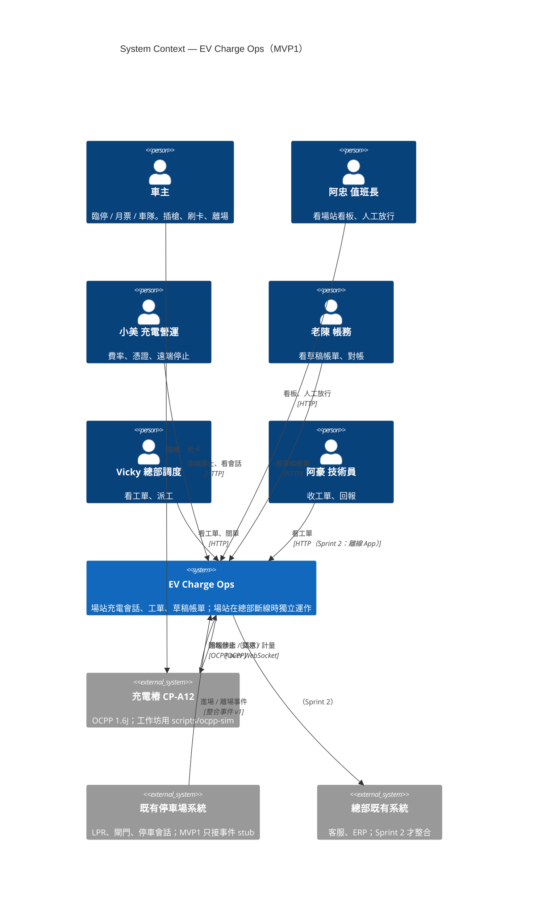
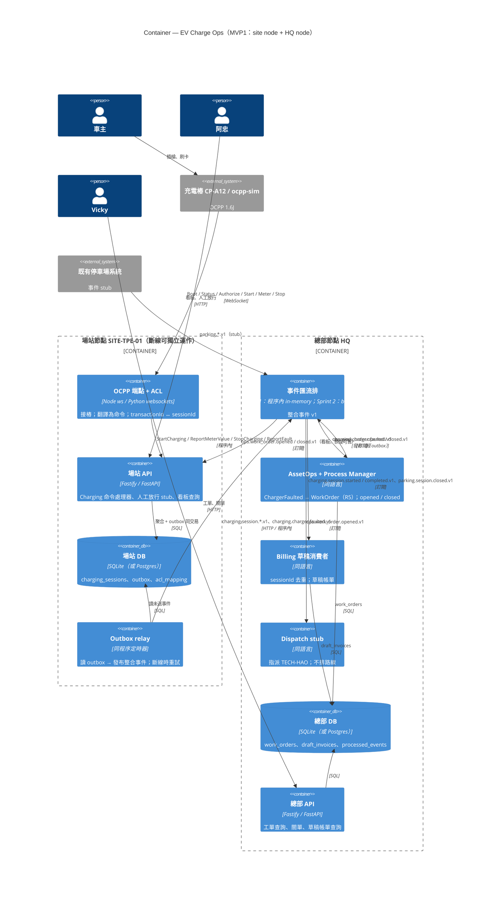

# C4 模型（C4 Model）

> Day 3 B3 的方法論。交付物：`workshop/day3/c4.md`。用 `/c4` 產 Mermaid。原始碼範例在 `docs/diagrams/c4-context.mmd` 與 `c4-container.mmd`。

## 讀完你會拿到

- C4 四個層級各回答什麼問題，以及本工作坊只畫前兩層的理由。
- 我們系統的 System Context 與 Container 圖的 Mermaid 原始碼，可以直接改。
- 一份「什麼不要畫」的清單——C4 圖最常見的失敗是畫太多。

---

## 1. 為什麼存在

Simon Brown 發明 C4 的動機：**架構圖沒有共同的抽象層級，所以沒人看得懂**。一張圖上同時有「AWS」「使用者」「UserService.java」「Kafka topic」，四種縮放等級混在一起。

C4 = Context、Container、Component、Code，四個縮放等級，像地圖：國家 → 城市 → 街區 → 建築。每一張圖只在一個等級。

對我們：Day 3 的產出要能給三種人看——Vicky（她只需要 Context）、你的 reviewer（Container）、未來接手的人（Container + 目錄）。

---

## 2. 四個層級

| 層級 | 回答 | 元素 | 我們畫嗎 |
|---|---|---|---|
| **1 System Context** | 這個系統是什麼？誰用它？它跟哪些外部系統講話？ | 人、我們的系統（一個框）、外部系統 | ✅ Day 3 |
| **2 Container** | 系統由哪些可獨立部署 / 執行的東西組成？ | 程序、DB、瀏覽器 app、檔案系統 | ✅ Day 3 |
| **3 Component** | 一個 container 裡有哪些主要模組？ | context、聚合、adapter | ⚠️ 用六角架構圖（`hexagonal.mmd`）代替 |
| **4 Code** | 類別長怎樣？ | class diagram | ❌ 程式碼本身就是圖 |

**Container ≠ Docker container**。C4 的 container 是「一個可以獨立跑的東西」：一個 Node 程序、一個 SQLite 檔、一個瀏覽器頁面。Docker 只是其中一種包裝。

---

## 3. 核心觀念

### 3.1 每張圖的四個必要元素

1. **標題**：層級 + 系統名（「System Context — EV Charge Ops」）。
2. **每個框**：名字、類型（人 / 系統 / container）、一句話描述、技術（container 層才有）。
3. **每條線**：動詞 + 協定（「送 OCPP 訊息 / WebSocket」），不要只畫箭頭。
4. **圖例**：如果用了顏色。

### 3.2 圖上的「我們」與「別人」

Context 層只有一個「我們的系統」框。既有停車場系統（LPR、閘門）在 MVP1 是**外部系統**——我們只接它的事件（`parking.vehicle_entered.v1` stub）。OCPP 樁是外部系統。總部既有的客服 / ERP 是外部系統。

### 3.3 兩個節點

Container 層的關鍵決定：**site node 與 HQ node 是兩組 container**，中間只有事件（Outbox relay → bus）。這是「場站在總部斷線時活著」的視覺表達。MVP1 實際上可以是同一台筆電上的兩個程序（或甚至一個程序兩個模組），但**圖要畫成兩個**，因為圖畫的是設計意圖。

---

## 4. Mermaid C4 語法

Mermaid 支援 `C4Context`、`C4Container`、`C4Component` 三種圖。語法要點：

```
Person(alias, "名字", "描述")
System(alias, "名字", "描述")
System_Ext(alias, "名字", "描述")
Container(alias, "名字", "技術", "描述")
ContainerDb(alias, "名字", "技術", "描述")
Container_Boundary(alias, "邊界名") { ... }
Enterprise_Boundary / System_Boundary 同理
Rel(from, to, "動詞", "協定")
BiRel(from, to, "動詞", "協定")
```

GitHub 的 Markdown 會直接渲染 ```` ```mermaid ```` 區塊。VS Code 裝 "Markdown Preview Mermaid Support"。或貼到 mermaid.live。

### 4.1 System Context



### 4.2 Container



兩張圖的原始碼在 `docs/diagrams/`。你的 `c4.md` 可以從那裡複製再改——但**必須對齊你自己的 context map**。如果你 Day 3 B2 只切了四個 context，Container 圖就不該有 Dispatch。

---

## 5. 什麼不要畫

| 不要畫 | 為什麼 | 該去哪 |
|---|---|---|
| 類別、方法 | 那是第 4 層，程式碼本身就是 | 不畫 |
| 每個 HTTP endpoint | Container 層的線是「動詞 + 協定」，不是 API 清單 | README-mvp.md |
| Docker、Kubernetes、AWS | 部署層；C4 有 Deployment diagram 但 MVP1 不需要 | Day 6 `docker-compose.yml` 註解 |
| 聚合與值物件 | Component 層；我們用六角架構圖代替 | `hexagonal.mmd` |
| 資料表欄位 | 太細 | migration 檔 |
| 沒有動詞的箭頭 | 讀者不知道那條線是什麼 | 補動詞 |
| 「未來會有的東西」畫成實線 | 混淆現況與願景 | 用 `(Sprint 2)` 標註或虛線 |
| 十五個框以上 | 超過一眼能看的量 | 拆圖或升層級 |
| OCPP 訊息名稱在 Context 層 | Context 層讀者是 Vicky | 留在 Container 層的線上 |

Simon Brown 的檢查法：**把圖給一個沒參與的人看 30 秒，請他講回來**。講不回來就是畫壞了。

---

## 6. 在本專案怎麼出現

| Day | C4 的影子 |
|---|---|
| 3 | 直接做 Context + Container |
| 4 | 六角架構目錄 = Component 層的替代 |
| 6 | Container 圖上的每個框變成真的程序 / 檔案；`README-mvp.md` 引用它 |
| 7 | PR 描述附 Container 圖連結；ADR-0002 引用它定 MVP1 範圍 |

---

## 7. 新手常犯的錯

| 錯 | 改法 |
|---|---|
| Context 圖上畫了 DB | DB 是 Container 層 |
| Container 圖上 site 與 HQ 混在一個邊界 | 兩個 `Container_Boundary` |
| 把 Docker container 當 C4 container | 一個 Node 程序 = 一個 container，不管有沒有 Docker |
| 線上沒寫協定 | 「WebSocket」「HTTP」「SQL」「訂閱」 |
| 畫了 Parking 的內部 | 它是外部系統 |
| 一張圖想講所有事 | 一張圖一個層級一個問題 |
| 用 flowchart 畫 C4 | 可以，但 Mermaid 有原生 C4 語法，用它 reviewer 比較好懂 |

---

## 8. `c4.md` 最低要求

1. System Context 圖：≥ 4 位角色、1 個我們的系統、≥ 2 個外部系統、每條線有動詞。
2. Container 圖：site 與 HQ 兩個邊界；每個 container 有技術欄；Outbox relay 與 bus 出現；資料庫分開。
3. 每張圖下面 3–5 行「這張圖想說的一件事」。
4. 一段「MVP1 不包含」的清單（對齊 ADR-0002）。

---

## 9. 延伸閱讀

- Simon Brown, *Software Architecture for Developers, Vol. 2: Visualise, document and explore your software architecture*, Leanpub。—— C4 的完整版。
- Simon Brown, c4model.com。—— 免費，含所有圖例與 FAQ；「Notation」與「FAQ」兩頁 20 分鐘。
- Simon Brown, "Visualising software architecture with the C4 model", GOTO 2019（演講）。
- Mermaid 官方文件 "C4 Diagram" 頁（mermaid.js.org）。—— 語法與限制（例如 `Rel` 的第 4 個參數）。
- Gregor Hohpe, *The Software Architect Elevator*, 2020, 第 III 部分 "Communicating"。—— 為什麼圖要分層級給不同人看。

---

## 自我檢查

1. C4 的 container 與 Docker container 的差別是什麼？我們的 Container 圖上有幾個 container？
2. 為什麼 Container 圖要畫成 site 與 HQ 兩個邊界，即使 MVP1 跑在同一台筆電上？
3. Context 圖上為什麼既有停車場系統是外部系統？什麼時候它會變成內部？
4. 「線上沒有動詞」為什麼是錯？舉一條你的圖上的線，補上動詞與協定。
5. 30 秒測試：請一個同事看你的 Container 圖然後講回來，他漏了什麼？
