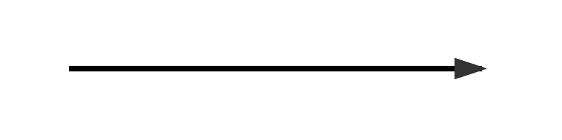

# Day 2 交付物範本 — 事件風暴與通用語言

存成 `storm-board.md`、`glossary.md`、`rules.md`。做法見 `docs/days/day2.md`。

---

## 檔案 1：`storm-board.md`

```markdown
# Event Storming Board

## 主時間線（黃貼 = 已發生的事實，過去式）
| # | 時間 | 事件（英文） | 中文 | 誰在乎 | 觸發它的命令 | 執行者 |
|---|---|---|---|---|---|---|

## 故障支線（F）
（同上表）

## Mermaid timeline


## 政策（Policy，「每當 X 就 Y」）
## 聚合候選（Aggregate candidates，動詞的受詞）
## 熱點（Hotspots，紅貼：爭議 / 不確定 / 外部系統）
## 樞紐事件（Pivotal events，畫垂直線的地方）
```

---

## 檔案 2：`glossary.md`

```markdown
# 通用語言 Glossary（本組版本）

| 中文 | 英文 | 是 | 不是 | 屬於哪條時間線 / 哪個候選邊界 |
|---|---|---|---|---|

## 我們決定「不要用」的詞（以及改用什麼）
```

---

## 檔案 3：`rules.md`

```markdown
# 領域規則（Given / When / Then）

<!-- 每條規則一段；至少 6 條（R1–R8 選 6）；每條至少一個成功例、一個拒絕例，帶數字 -->

## R1 連接器占用時拒絕第二次 Start
- Context:
- 命令（Command）:
- 成功事件 / 拒絕事件:
### 例 1（拒絕）
Given
When
Then
### 例 2（成功）
Given
When
Then

## R2 …
```
